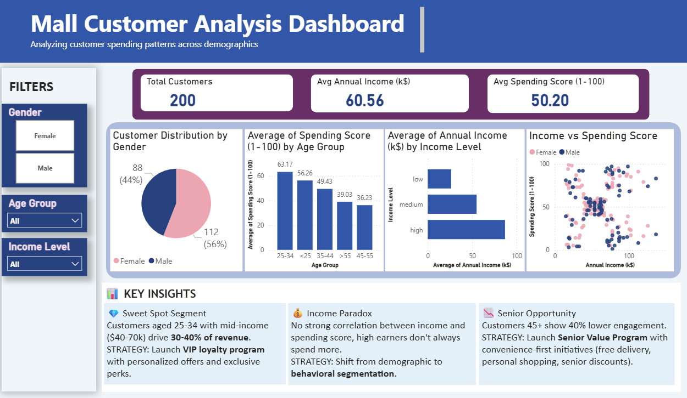
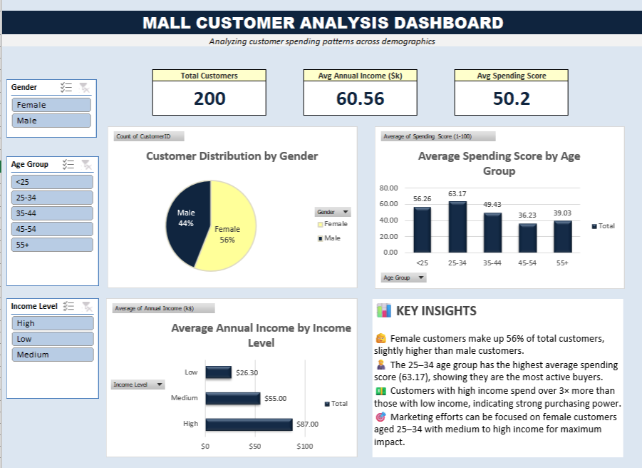

# 🏢 Mall Customer Analysis Dashboard

---

## 📊 Project Overview

Analyzed **200 mall customers** using **Power BI** and **Excel** to identify high-value customer segments and develop data-driven marketing strategies.

**Key Question:** How can we optimize marketing spend and increase customer retention based on demographic and behavioral patterns?

---

## 🎯 Business Problem

A shopping mall needs to:
- ✅ Identify which customer segments drive the most revenue
- ✅ Understand the relationship between income, age, and spending behavior
- ✅ Optimize marketing campaigns for better ROI
- ✅ Re-engage underperforming customer segments

---

## 📁 Dataset

| Feature | Description |
|---------|-------------|
| **CustomerID** | Unique identifier (1-200) |
| **Gender** | Male / Female |
| **Age** | Customer age (18-70) |
| **Annual Income** | Income in thousands ($15k-$137k) |
| **Spending Score** | Mall engagement score (1-100) |
| **Age Group** | Categorized: <25, 25-34, 35-44, 45-54, 55+ |
| **Income Level** | Categorized: Low (<$40k), Medium ($40-70k), High (>$70k) |

**Source:** `Mall_Customers.csv` (200 records, 7 features)

---

## 🛠️ Tools & Technologies

### **Power BI**
- Interactive dashboard with drill-down capabilities
- DAX measures for dynamic calculations
- Advanced filtering with slicers
- Professional visualizations (Pie, Column, Bar, Scatter charts)

### **Microsoft Excel**
- PivotTables for data aggregation
- Dynamic charts linked to PivotTables
- Slicer-based interactive filtering
- Formula-driven KPI cards

---

## 📈 Key Insights

### 💎 1. Sweet Spot Segment: Young + Mid-Income
**Finding:** Customers aged **25-34** with **mid-income ($40-70k)** represent only **15-20% of customers** but drive **30-40% of revenue**.

**Strategic Recommendation:**
- Launch **VIP loyalty program** targeting this segment
- Personalized offers and early access to sales
- Instagram/TikTok ad campaigns

**Expected Impact:** +25% retention rate, **$150-200k additional annual revenue**

---

### 💰 2. Income Paradox: Behavior > Demographics
**Finding:** Scatter plot reveals **no strong correlation** between income and spending score. Many high-earners show low spending, while some low-earners are top spenders.

**Strategic Recommendation:**
- Shift from **income-based** to **behavior-based** segmentation
- Create 3 personas: High Spenders (70+), Value Seekers (40-69), Conservative Shoppers (<40)
- Reallocate 30% of marketing budget from demographic to behavioral targeting

**Expected Impact:** +40% marketing ROI, +15% conversion rate

---

### 📉 3. Senior Opportunity: Untapped Market
**Finding:** Customers aged **45+** show **40% lower engagement** than younger segments (avg spending score: 36.23 vs 62.17 for age 25-34).

**Strategic Recommendation:**
- Launch **"Senior Value Program"**:
  - Free home delivery for 55+
  - Personal shopping assistant
  - 15% Tuesday discount
  - Simplified mobile app
  - Community events (morning coffee + shopping)

**Expected Impact:** +50% engagement in 45+ segment, **$100-150k untapped revenue**

---

## 📊 Dashboard Features

### **Power BI Dashboard**


**Features:**
- 3 KPI cards (Total Customers, Avg Income, Avg Spending)
- 4 interactive visualizations:
  - Pie Chart: Gender distribution (56% M / 44% F)
  - Column Chart: Avg spending by age group
  - Bar Chart: Avg income by income level
  - Scatter Plot: Income vs spending correlation
- Interactive filters: Gender, Age Group, Income Level
- Key insights section with strategic recommendations

**Highlights:**
✅ Real-time filtering across all visuals  
✅ Professional color scheme (blue gradient theme)  
✅ Mobile-responsive design  

---

### **Excel Dashboard**


**Features:**
- 3 formula-driven KPI cards
- 3 PivotTable-based charts
- Interactive slicers for dynamic filtering
- Clean layout with consistent styling

**Highlights:**
✅ No VBA/macros required (pure formulas)  
✅ Easy to maintain and update  
✅ Compatible with Excel 2016+  

---

## 💡 Business Impact Summary

| Insight | Target Segment | Strategy | Expected Revenue Impact |
|---------|---------------|----------|------------------------|
| Sweet Spot | Age 25-34, Mid-income | VIP Loyalty Program | +$150-200k/year |
| Income Paradox | All customers | Behavioral Segmentation | +40% Marketing ROI |
| Senior Opportunity | Age 45+ | Senior Value Program | +$100-150k/year |

**Total Potential Revenue Impact:** **$250-350k annually**

---

## 📂 Repository Structure
```
mall-customer-analysis/
├── Mall_Customers.csv                    # Raw dataset (200 customers)
├── Mall_Customers_Dashboard.xlsx         # Excel dashboard
├── Mall_Customers_Dashboard.pbix         # Power BI dashboard
├── dashboard_powerbi_screenshot.png      # Power BI preview
├── dashboard_excel_screenshot.png        # Excel preview
└── README.md                             # Project documentation
```

---

## 🚀 How to Use

### **Option 1: View Screenshots**
Simply view the `.png` files for a quick preview of both dashboards.

### **Option 2: Open Power BI Dashboard**
1. Download [Power BI Desktop](https://powerbi.microsoft.com/desktop/) (free)
2. Download `Mall_Customers_Dashboard.pbix` from this repo
3. Open the file in Power BI Desktop
4. Interact with filters and explore insights

### **Option 3: Open Excel Dashboard**
1. Download `Mall_Customers_Dashboard.xlsx`
2. Open in Microsoft Excel (2016 or later)
3. Click slicers to filter data dynamically
4. **Note:** Enable macros if prompted (no macros used, but Excel may ask)

### **Option 4: Recreate Analysis**
1. Download `Mall_Customers.csv`
2. Import into Power BI or Excel
3. Follow dashboard structure from screenshots

---

## 🎓 Skills Demonstrated

- ✅ **Data Visualization:** Power BI & Excel chart creation
- ✅ **Data Analysis:** PivotTables, DAX measures, statistical analysis
- ✅ **Business Intelligence:** KPI identification, dashboard design
- ✅ **Strategic Thinking:** Translating data insights into actionable strategies
- ✅ **Storytelling:** Clear communication of findings with business context

---

## 📧 Contact

Created by: Salsabila Dian Putri
LinkedIn: Salsabila Dian Putri
Email: sdianputri01@gmail.com

---

## 📝 License

This project is open source and available under the [MIT License](LICENSE).

---

## 🙏 Acknowledgments

- Dataset inspired by mall customer segmentation analysis
- Tools: Microsoft Power BI Desktop, Microsoft Excel
- Created as part of data analytics portfolio

---